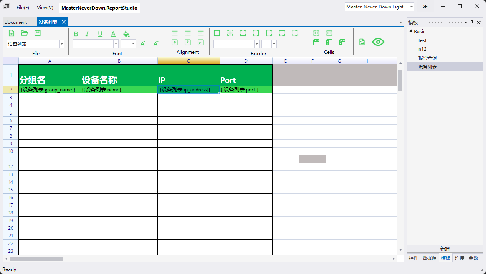
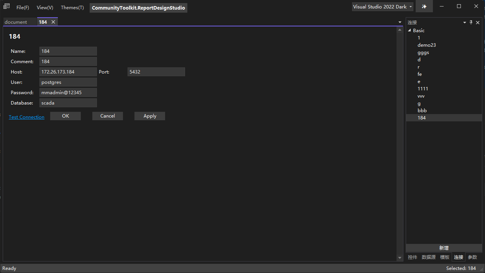
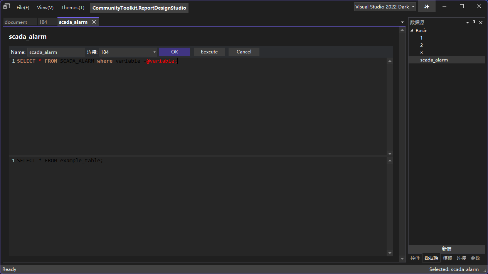
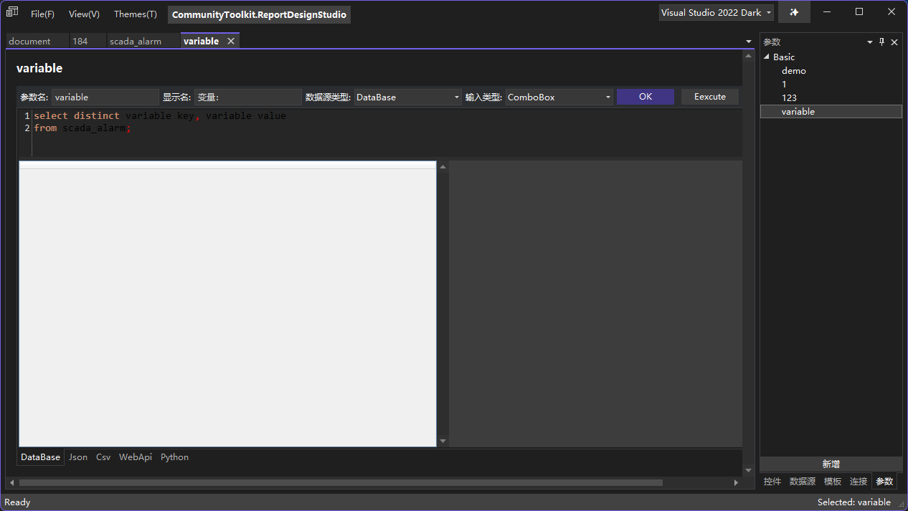
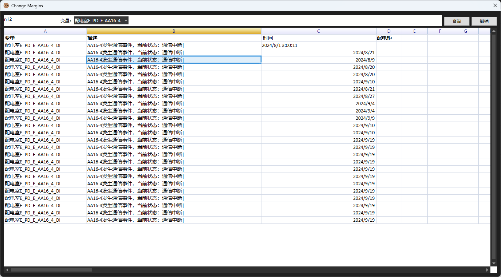
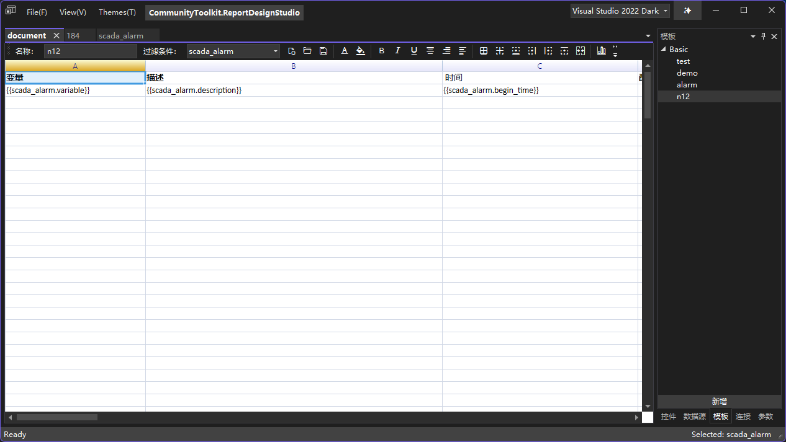

## 1. Features

### Designer

### Connection Management

- [x] mysql
- [x] postgres
- [x] sqlite
- [x] oracle
- [ ] inlfuxDB 
- [ ] api 
- [ ] json file 

### DataSource Management

- [x] List
- [ ] Single Model
- [ ] Single Value

### Parameter Management

- [x] 多数据源
    - [x] Database
    - [ ] Json
    - [ ] Csv
    - [ ] WebApi
    - [ ] Python
- [ ] 输入类型
    - [x] ComboBox

### Template Design
- [x] File
    - [x] Open
    - [x] New
    - [x] Save
- [x] Font Style
    - [x] Blod
    - [x] Italic
    - [x] Underline
- [x] Horizontal
    - [x] Center
    - [x] Right
    - [x] Left
- [x] Border
    - [x] Outside
    - [x] InnerSide
    - [x] Bottom
    - [x] Right
    - [x] Left
- [x] Preview

- [ ] Header Freeze
- [ ] Column Freeze
- [ ] OuterLine

### Timer Job

- [ ] cron

### 主题切换
- [x] Dark
- [x] ight
- [x] Green

### 双语切换
- [x] en
- [x] cn

## 3.LICENSE

