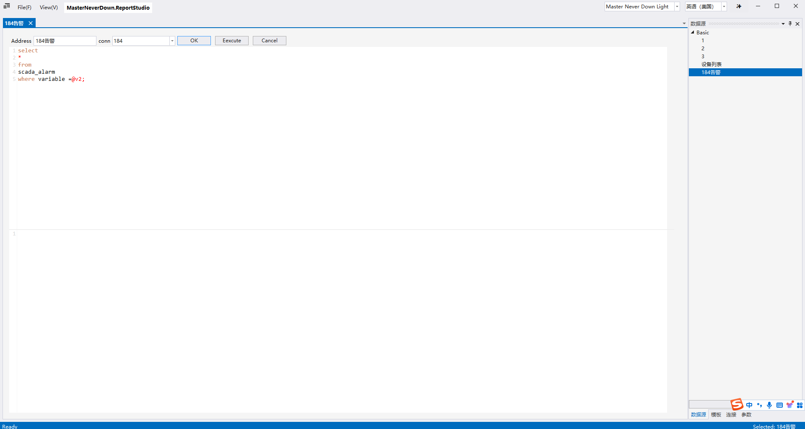

[toc]
## 一、项目结构

## 二、设计器

### 2.1 连接管理
- [x] postgres
- [ ] mysql
- [ ] sqlite
- [ ] oracle
- [ ] inlfuxDB 
- [ ] api 
- [ ] json file 

### 2.2 数据源管理
- [x] 列表数据源
- [ ] 单个实体数据源
- [ ] 单个值

### 2.3 参数管理

- [x] 多数据源
    - [x] 数据库
    - [ ] Json
    - [ ] Csv
    - [ ] WebApi
    - [ ] Python
- [ ] 输入类型
    - [x] ComboBox
    - [ ] TextBox
    - [ ] Datetime
    - [ ] DateRange
    - [ ] Radio Button Group
    - [ ] CheckBox Group

### 2.4 模板设计
- [x] File
    - [x] Open
    - [x] New
    - [x] Save
- [x] Font Style
    - [x] Blod
    - [x] Italic
    - [x] Underline
- [x] Horizontal
    - [x] Center
    - [x] Right
    - [x] Left
- [x] Border
    - [x] Outside
    - [x] InnerSide
    - [x] Bottom
    - [x] Right
    - [x] Left
- [x] Preview

- [x] Header Freeze
- [x] Column Freeze
- [x] OuterLine

### 2.5主题切换
- [x] 深色主题
- 
- [x] 浅色主题
- 
- [x] 绿色主题
- 
### 2.6双语切换
- [x] 英语（美国）
- [x] 中文（简体）

## 三、报表查看器

## 四、报表自定义集成

## 五、LICENSE

